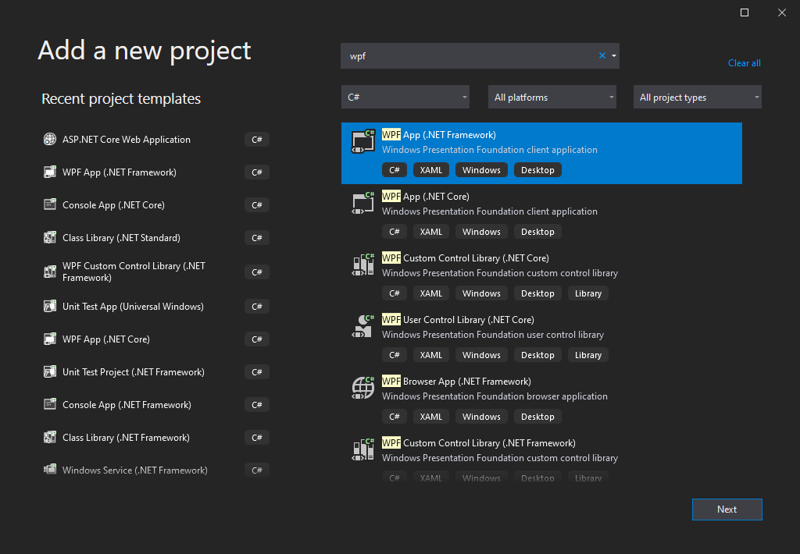

# 一个简单的示例项目

此示例源码位于项目中的[`Hubery.Sqless.Demo.Wpf 和 Hubery.Sqless.Demo.Api`](https://github.com/hbrwang/sqless)

示例项目比较简单，模拟商店出售一些商品，用户根据账号密码登录，登录后可查看或购买商品，并且可以查看订单信息。

## 快速开始

### 环境变量

运行示例请先配置环境变量中用户变量，新增记录`SqlessTestSqlConStr`，值为 sql server 连接字符串，如

```
Data Source=.;Initial Catalog=StoreTest;User ID=sa;Password=123456
```

当然你也可以修改 `Hubery.Sqless.Demo.Common.Global` 中的 `SqlConStr` 属性，返回你的数据库连接字符串。建议测试使用环境变量，不用修改代码。

### 运行

先以 `Debug` 运行 `Hubery.Sqless.Demo.Api`，默认端口是 6688，如果被占用需要在项目属性中更改。

再运行`Hubery.Sqless.Demo.Wpf`。WPF 客户端默认调用 API 的端口是 6688，如果已更改，请修改 `Hubery.Sqless.Demo.Wpf.WpfGlobal` 中的 `ApiUrl` 属性。

至此，你可以愉快的测试 `Sqless` 的商品购买小实例了。查看代码，你将看到在 WPF 中是如此安全简单的访问数据库。

## 数据库设计

### 分析

1.  User 表，用于存储用户信息，包括 Uid，Password，Name 等
2.  Product 表，用于存储商品信息
3.  Order 表，用于存储购买信息

### 下载测试数据库

下载并还原数据库备份文件：
<ClientOnly>
<DbDownload />
</ClientOnly>

### 权限分析

#### User 表

客户端可读写，但 Password 字段不可读写，Uid 字段只读。因此权限配置中，应该有以下内容：

```CSharp
            var result = new SqlessConfig()
            result.OwnerAuths.Add(new SqlessFieldAuth()
            {
                Readable = true,
                Writable = true,
                Table = Tables.User,
                Field = "Uid"
            });
            result.FieldAuths.Add(new SqlessFieldAuth()
            {
                Readable = false,
                Writable = false,
                Table = Tables.User,
                Field = "Password"
            });
```

#### Product 表

客户端只读，用于查看商品信息。因此权限配置中，应该有以下内容：

```CSharp
            var result = new SqlessConfig()
            result.FreeAuths.Add(new SqlessAuth()
            {
                Readable = true,
                Writable = false,
                Table = Tables.Product
            });
```

#### Order 表

客户端可读写，但只能读写登录用户所创建的记录，并且 Id 字段不可修改。因此权限配置中，应该有以下内容：

```CSharp
            var result = new SqlessConfig()
            result.OwnerAuths.Add(new SqlessFieldAuth()
            {
                Readable = true,
                Writable = true,
                Table = Tables.Order,
                Field = "Uid"
            });
```

#### 权限配置示例

```CSharp
        private SqlessConfig GetOwnerAccessConfig(string authUid)
        {
            var result = SqlessConfig.GetOwnerConfig(_sqlConStr, authUid);
            result.AuthUid = authUid;

            result.OwnerAuths.Add(new SqlessFieldAuth()
            {
                Readable = true,
                Writable = true,
                Table = Tables.User,
                Field = "Uid"
            });

            result.OwnerAuths.Add(new SqlessFieldAuth()
            {
                Readable = true,
                Writable = true,
                Table = Tables.Order,
                Field = "Uid"
            });

            result.FieldAuths.Add(new SqlessFieldAuth()
            {
                Readable = false,
                Writable = false,
                Table = Tables.User,
                Field = "Password"
            });

            result.FreeAuths.Add(new SqlessAuth()
            {
                Readable = true,
                Writable = false,
                Table = Tables.Product
            });

            return result;
        }
```

## 创建测试解决方案

### 创建解决方案

使用 visual studio 2019 新建解决方案，选择空解决方案 `Blank Solution`


解决方案名称为 `Hubery.Sqless`。

### 创建 WebApi 项目

再创建 WebApi 项目，选择`ASP.NET Core Web Application`


类型选择 API，名称为`Hubery.Sqless.Demo.Api`


### 创建客户端项目

创建桌面客户端 Wpf 项目，选择`WPF App [.NET Framework]`



## 安装 nuget 包

API 和客户端分别安装。在包管理器中运行以下语句，或搜索`Sqless`并安装

```Shell
Install-Package Sqless
```

## WebApi 开发

此部分操作在 WebApi 项目中。

### 依赖注入

在`Startup.cs`的`ConfigureServices`函数中添加依赖注入

```CSharp
public void ConfigureServices(IServiceCollection services)
{
    services.AddControllers();
    services.AddTransient<SqlessAccess, SqlessAccessPassword>((ctx) =>
    {
        return Global.PasswordAccessConfig as SqlessAccessPassword;
    });
    services.AddTransient<SqlessConfig, SqlessConfig>((ctx) =>
    {
        return Global.GetOwnerAccessConfig();
    });
}
```

此处添加的身份认证方法是 Account/Password，如果需要使用 Token，则上面那个依赖注入改为

```CSharp
services.AddTransient<SqlessAccess, SqlessAccessToken>(/* ... */)
```

其中，`Global.PasswordAccessConfig`为

```CSharp
public static SqlessAccess PasswordAccessConfig => new SqlessAccessPassword()
{
    UidField = "Uid",
    SqlConStr = SqlConStr,
    AccessTable = Tables.User,
    AccessAccountField = "Uid",
    AccessPasswordField = "Password"
};
```

`Global.GetOwnerAccessConfig()`为

```CSharp
public static SqlessConfig GetOwnerAccessConfig(string authUid = null)
{
    var result = SqlessConfig.GetOwnerConfig(SqlConStr, authUid);
    result.AuthUid = authUid;

    result.OwnerAuths.Add(new SqlessFieldAuth()
    {
        Readable = true,
        Writable = true,
        Table = Tables.User,
        Field = "Uid"
    });

    result.OwnerAuths.Add(new SqlessFieldAuth()
    {
        Readable = true,
        Writable = true,
        Table = Tables.Order,
        Field = "Uid"
    });

    result.FieldAuths.Add(new SqlessFieldAuth()
    {
        Readable = false,
        Writable = false,
        Table = Tables.User,
        Field = "Password"
    });

    result.FreeAuths.Add(new SqlessAuth()
    {
        Readable = true,
        Writable = false,
        Table = Tables.Product
    });

    return result;
}
```

`SqlConStr`为数据库连接字符串，如

```CSharp
public static string SqlConStr = "Data Source=127.0.0.1;Initial Catalog=StoreTest;User ID=sa;Password=123456";
```

### 创建 Controller

新建 `Controller`，名称为`SqlessController`

```CSharp
    [Route("api/[controller]/[action]")]
    [ApiController]
    public class SqlessController : SqlessAccessController
    {
        public SqlessController(SqlessAccess sqlessAccess, SqlessConfig sqlessConfig)
            : base(sqlessAccess, sqlessConfig)
        {

        }
    }
```

在 WebApi 项目中，主要配置数据库独写权限。
这个 Controller 非常简单，做完此操作，WebApi 端就差不多完事了，接下来的开发，除特殊情况就不用管 API 端了

## 客户端开发

客户端使用 WPF 框架，并使用 MVVMLight

需求分析：

1. 登录页面，输入账号密码登录
2. 展示商品列表，可查看并购买
3. 订单信息

因此客户端需要三个页面

### 登陆页面

登陆页面比较简单，登录的主要代码如下：

```CSharp
var request = new SqlessSelectRequest()
{
    Table = "User",
    AccessParams = new string[] { Account, Password }
};

// 根据类型加载字段，并且排除Password字段。
// 如果不排除Password字段，会因权限问题报错，因为前面WebApi已经配置Password字段不可读
request.LoadFromType(typeof(User), null, nameof(User.Password));

var user = await SqlessClient.SelectFirstOrDefault<User>(request);
```

登录完成后，存储并显示当前登录信息，转到商品列表

### 商品列表

展示商品列表，可购买指定商品


#### 获取商品

获取商品列表的主要代码如下：

```CSharp
var request = new SqlessSelectRequest()
{
    AccessParams = new string[] { User.Uid, User.Password },
    Table = Tables.Product
};
request.LoadFromType(typeof(Product));

var products = await SqlessClient.Select<Product>(request);
```

获取后，在 VM 中绑定到 View 的列表显示。在列表中，每个商品后都有个按钮可以购买商品。

#### 生成订单

点击按钮，生成订单信息

```CSharp
var order = new Order()
{
    Id = Guid.NewGuid().ToString(),
    ProductId = product.Id,
    Status = 1,
    Time = DateTimeOffset.Now.ToUnixTimeSeconds(),
};
var request = new SqlessEditRequest()
{
    Table = Tables.Order,
    AccessParams = new string[] { User.Uid, User.Password },
};
request.LoadFromObject(order);

await SqlessClient.Insert(request);
```

此处，仅仅生成订单信息，并未付款。

#### 付款

修改 Status 字段以标识已付款。

::: warning
真实情况中， Order 表的 Status 字段应该设置为只读，付款时在 API 中更改 Status 字段。

如支付宝/微信等，用过 WebApi 接口的回调来确认用户已付款，并在回调接口中更改已付款标识，客户端由于安全性不应有修改权限。
:::

```CSharp
var request = new SqlessEditRequest()
{
    Table = Tables.Order,
    AccessParams = new string[] { User.Uid, User.Password },
    Fields = new System.Collections.Generic.List<SqlessEditField>()
    {
        new SqlessEditField()
        {
            Field=nameof(Order.Status),
            Value=2,
            Type=System.Data.DbType.Int32
        }
    },
    Queries = new System.Collections.Generic.List<Query.SqlessQuery>()
    {
        new Query.SqlessQuery()
        {
            Field=nameof(Product.Id),
            Type=Query.SqlessQueryType.Equal,
            Value=orderId
        }
    }
};

await SqlessClient.Update(request);
```

### 订单列表

展示用户已付款和未付款的订单，并且可在此处进行付款。


#### 获取订单列表

获取订单列表的主要代码：

```CSharp
var request = new SqlessSelectRequest()
{
    AccessParams = new string[] { WpfGlobal.LoginUser.Uid, WpfGlobal.LoginUser.Password },
    Table = Tables.Order
};
request.LoadFromType(typeof(Order));

var orders = await SqlessClient.Select<Order>(request);
```

与商品列表类似，绑定到 View 的列表显示。在列表中，每个订单都可被删除，如果订单未付款，也可在此处付款。

#### 付款

付款与在商品列表中付款操作相同

#### 删除

删除订单的主要代码如下：

```CSharp
var request = new SqlessDeleteRequest()
{
    AccessParams = new string[] { WpfGlobal.LoginUser.Uid, WpfGlobal.LoginUser.Password },
    Table = Tables.Order,
    Queries = new System.Collections.Generic.List<Query.SqlessQuery>()
    {
        new Query.SqlessQuery()
        {
            Field=nameof(Order.Id),
            Type=Query.SqlessQueryType.Equal,
            Value=order.Id
        }
    }
};

await SqlessClient.Delete(request);
Orders.Remove(order);
```
